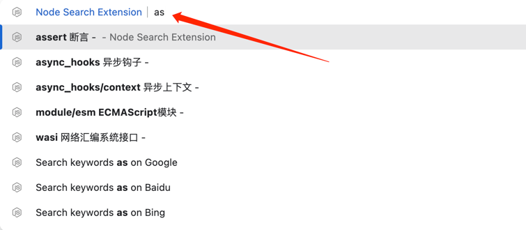
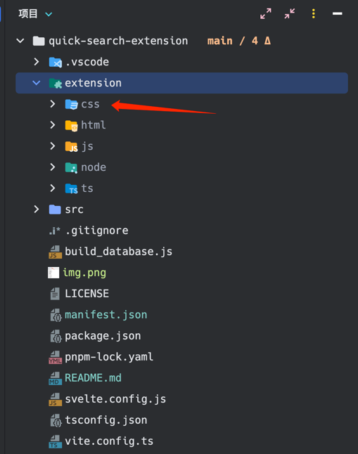

# node-search-extension

## quick search for node, js, ts, css, html



## Usage

``` 
   pnpm i
   pnpm run build:node
   pnpm run build:js
   pnpm run build:ts
   pnpm run build:css
   pnpm run build:html
   
   // install extension
   // see extension folder
```

